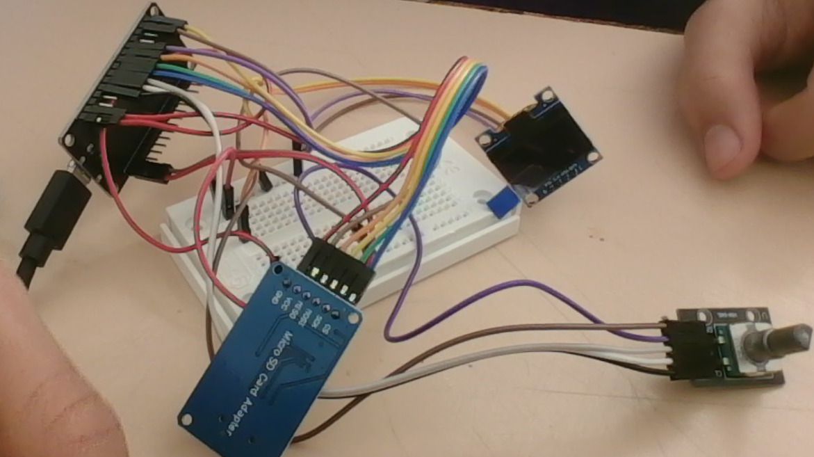
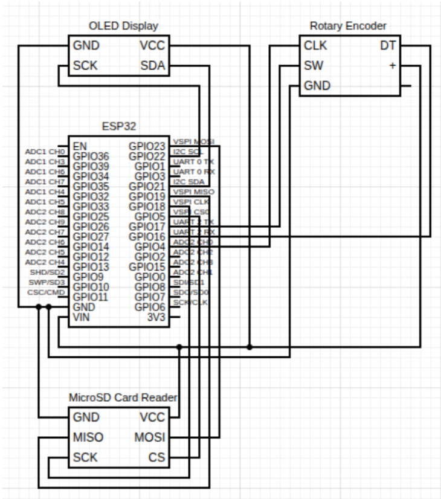

# Game-Chooser

## Components
NOTE: I am not currently using the microSD card reader as of right now.

### MicroSD Card Reader
Generic MicroSD Card Reader, uses 3V3

### Rotary Encoder
Rotary encoder HW-040, uses 3V3

### OLED Display
128x64 OLED (GM009605v4.3), uses 5V power, monochrome

### ESP32
Generic ESP32 DevKit, 5V power required.

## Power Supply
Requires a 5V power source for the device and all components to function properly. I am currently using a USB-C cable for development, however you can use any 5V battery.

## Circuit Example

## Circuit Diagram

## Relevant Implications
### Usability
Usability is critical because the device relies entirely on a minimal user interface. It consists of a single rotary encoder with a push button and a small 128x64 pixel monochrome OLED display. Without thoughtful interaction design, navigating nested menus on a tiny screen could quickly become frustrating.

How it is addressed in the design:

Visual Ownership Markers: Devices already added to the user's collection are dynamically tagged with an asterisk (*) in the menu rendering (renderMenu), giving instant feedback on system state.

Smart Text Wrapping: Full game titles (like "The Legend of Zelda: Tears of the Kingdom") easily exceed the display's 21-column width. The custom printWrapped() function breaks lines at word spaces rather than cutting words off mid-character.

Persistent Screen Navigation Hints: Dedicated bottom rows show contextual control prompts (e.g., "Scroll: adjust", "Click: start"), eliminating user guesswork.

Rotary Boundaries and Acceleration: Using rotaryEncoder.setBoundaries() prevents index overflow errors, while encoder acceleration ensures smooth scrolling through long lists like the 15 Nintendo models.
### Intellectual Property & Legal
Intellectual Property (IP) is a major consideration because the code explicitly hardcodes trademarked brand names (Playstation, Xbox, Nintendo), hardware model names (PS5, Switch 2, Xbox Series X), and published game titles (Final Fantasy VII, Halo, Pokémon).

How it is addressed in the design:
Personal, Non-Commercial Scope: The software operates entirely locally on an embedded micro-controller as a personal hobbyist utility. It does not distribute copyrighted assets, code, ROMs, artwork, or audio files. It only references textual names.

Fair Use / Nominal Use: Referring to brand names strictly to identify physical consoles and games in a user's personal collection falls under nominal fair use.

Zero Cloud Dependence: The device operates offline without scraping trademarked metadata or connecting to proprietary APIs, avoiding potential terms-of-service violations or network-based trademark claims.
### Functionality 
Functionality dictates whether the device performs reliably within hardware constraints. The ESP32 micro-controller has limited display area, specific pin capabilities, and power constraints, requiring careful code structure to prevent crashes, frozen screens, or inaccurate timer behavior.

How it is addressed in the design:
Non-Blocking Power Management: The sleepScreenIfIdle() function turns off the OLED display after 5 minutes of inactivity (SCREEN_TIMEOUT_MS) to save power and prevent OLED screen burn-in.

Wake-Up Input Protection: The wakeScreenIfAsleep() function intercepts the first button press or rotation after sleep to turn the display back on without accidentally triggering an unintended menu action.

True Hardware Entropy: The randomizer relies on esp_random() to seed the random generator, utilizing internal hardware noise rather than predictable analog read pins to ensure fair game selection.

Shared Memory Game Allocation: Consoles with identical libraries (e.g., PSTV/Vita, Xbox Series S/X) share array pointers (psGameLists, xboxGameLists) to optimize memory footprint.
