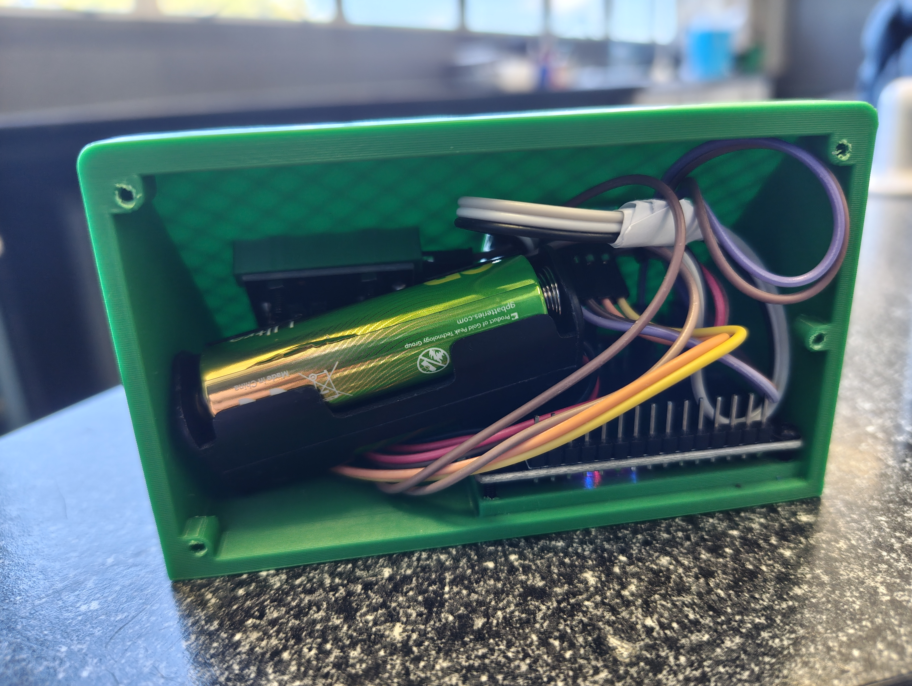
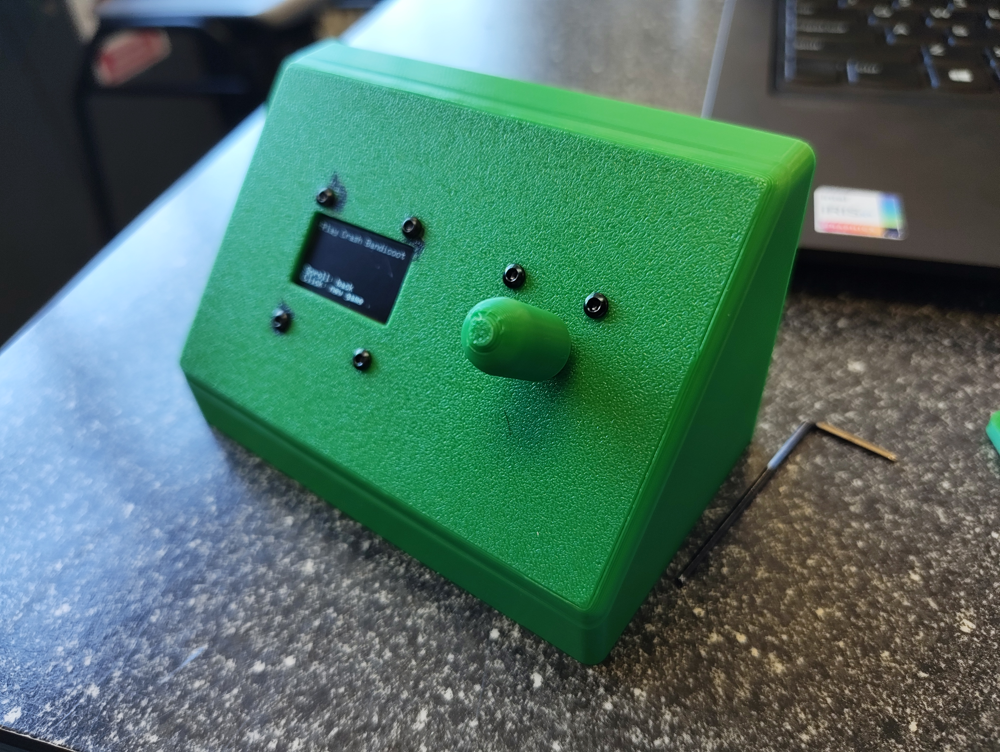

# Game-Chooser

## Case

Designed with OnShape

### Securing the OLED and Rotary Encoder
The Game Chooser is assembled with exclusively 2mm screws, using nuts on the back side of the OLED and the Rotary Encoder. In assembly you secure these on first, as it will be difficult to access these later.

### Securing the ESP32 to the bottom of the case

The holes under the ESP32 (on the right) will be slightly smaller than 2mm due to print tolerance, therefore allowing the 2mm screw to hold itself using the plastic of the case alone. Secure the ESP32 using the shorter M2 screws, or with nuts between a longer M2 screw and the ESP32.

### Securing the batteries

The battery will be a very tight fit, with the wire end of the AA holder pointing towards the ESP32. Slide in the battery case between the ESP32 pins that stick up, pushing it in the ESP32 direction while pushing it into the case. Once this is done you should have everything inside the case, just push the remaining wires into the case.

### Securing the back panel

The back panel screws will be slightly smaller than 2mm due to print tolerance, therefore allowing the 2mm screw to hold itself using the plastic of the case (and the back panel). Simply screw almost any M2 screw with a long enough length to grip both the back panel and the main body of the case in each of the screw holes. You will need to use reasonable force to do so, you can increase the size of the holes using a drill bit with a diameter of 2mm or less, make sure not to expand it too much otherwise the screw will not grip the plastic properly. Only expand the holes if you have to. If you have a good 3D printer this should not be necessary.

## Firmware

The firmware is written in C++.

Simply flash the .cpp file I have included in the firmware folder using PlatformIO or Arduino IDE. If using either of these, you can check platformio.ini for the platform. The board is simply a generic ESP32 Development Board and I have included the libraries you need to install below.

### Required Libraries

marcoschwartz/LiquidCrystal_I2C@^1.1.4
igorantolic/Ai Esp32 Rotary Encoder@^1.7
smougenot/TM1637@0.0.0-alpha+sha.9486982048
adafruit/Adafruit SSD1306@^2.5.17
adafruit/Adafruit GFX Library@^1.12.6

## Assembly

### PLEASE NOTE, there may not be enough GND and 3V3 pins for all of the components, you may need to solder a few wires together in order for all components to have GND and power.

Bill of Materials (BOM):

### My 3D printed case
Provided in .STEP format in this repo. Includes the Rotary Encoder cap, body of the case, and back panel.

### Screws
1x M2 Flat Head Screw Set, view an example [here](https://www.amazon.com/dp/B0DHZSPYHH?lv=shuf&channelId=500&plpRedirect=mhFallback)

### Rotary Encoder
1x Rotary encoder HW-040, uses 3V3

### OLED Display
1x 128x64 OLED (GM009605v4.3), uses 5V or 3.3V power, monochrome

### ESP32
1x Generic ESP32 DevKit, 5V OR 3.3V power required.

### Power Supply (AA Batteries)
2x AA Batteries

1x AA x2 Double Side Battery Holder, view an example [here](https://www.ebay.com/itm/254646729123?chn=ps&mkevt=1&mkcid=28&var=554695432330&google_free_listing_action=view_item&srsltid=AU7gw4Vma__uR93r1F5QwdD6DBC5oE9ANeM5KXRjdNMFptC49Ez4xrGP2H0)

#### PLEASE NOTE: if you are using a 3V or 3.3V battery, plug the battery into the 3V3 pin and plug all components and are plugged into VIN in the diagram into the 3V3 pin instead.

This circuit requires a 5V, 3V or 3.3V power source for the device and all components to function properly. I am currently using a USB-C cable for development and AA batteries for the final circuit, however you can use any 5V, 3.3V or 3V battery. For instance, you can also use a 3V pair of AA batteries wired in series (as shown in the example) or any other power source. The choice is yours!

Please refer to the circuit diagram for assistance in assembling the circuit.

## Breadboard Collapsed Example (No battery)

## Constructed Circuit (With battery)

## Circuit Diagram

NOTE: I did not end up using the MicroSD Card reader.

## Relevant Implications
### Usability
Usability is critical because the device relies entirely on a minimal user interface. It consists of a single rotary encoder with a push button and a small 128x64 pixel monochrome OLED display. Without thoughtful interaction design, navigating nested menus on a tiny screen could quickly become frustrating.

How it is addressed in the design:

Visual Ownership Markers: Devices already added to the user's collection are dynamically tagged with an asterisk (*) in the menu rendering (renderMenu), giving instant feedback on system state.

Smart Text Wrapping: Full game titles (like "The Legend of Zelda: Tears of the Kingdom") easily exceed the display's 21-column width. The custom printWrapped() function breaks lines at word spaces rather than cutting words off mid-character.

Persistent Screen Navigation Hints: Dedicated bottom rows show contextual control prompts (e.g., "Scroll: adjust", "Click: start"), eliminating user guesswork.

Rotary Boundaries and Acceleration: Using rotaryEncoder.setBoundaries() prevents index overflow errors, while encoder acceleration ensures smooth scrolling through long lists like the 15 Nintendo models.
### Intellectual Property & Legal
Intellectual Property (IP) is a major consideration because the code explicitly hardcodes trademarked brand names (Playstation, Xbox, Nintendo), hardware model names (PS5, Switch 2, Xbox Series X), and published game titles (Final Fantasy VII, Halo, Pokémon).

How it is addressed in the design:
Personal, Non-Commercial Scope: The software operates entirely locally on an embedded micro-controller as a personal hobbyist utility. It does not distribute copyrighted assets, code, ROMs, artwork, or audio files. It only references textual names.

Fair Use / Nominal Use: Referring to brand names strictly to identify physical consoles and games in a user's personal collection falls under nominal fair use.

Zero Cloud Dependence: The device operates offline without scraping trademarked metadata or connecting to proprietary APIs, avoiding potential terms-of-service violations or network-based trademark claims.
### Functionality 
Functionality dictates whether the device performs reliably within hardware constraints. The ESP32 micro-controller has limited display area, specific pin capabilities, and power constraints, requiring careful code structure to prevent crashes, frozen screens, or inaccurate timer behavior.

How it is addressed in the design:
Non-Blocking Power Management: The sleepScreenIfIdle() function turns off the OLED display after 5 minutes of inactivity (SCREEN_TIMEOUT_MS) to save power and prevent OLED screen burn-in.

Wake-Up Input Protection: The wakeScreenIfAsleep() function intercepts the first button press or rotation after sleep to turn the display back on without accidentally triggering an unintended menu action.

True Hardware Entropy: The randomizer relies on esp_random() to seed the random generator, utilizing internal hardware noise rather than predictable analog read pins to ensure fair game selection.

Shared Memory Game Allocation: Consoles with identical libraries (e.g., PSTV/Vita, Xbox Series S/X) share array pointers (psGameLists, xboxGameLists) to optimize memory footprint.
